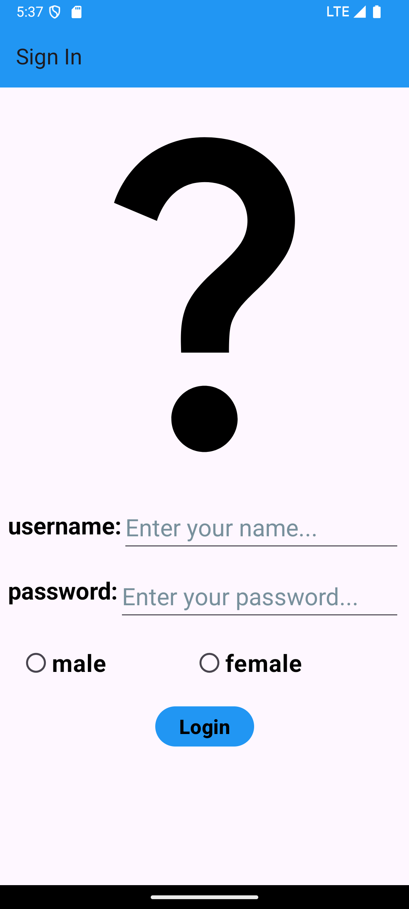
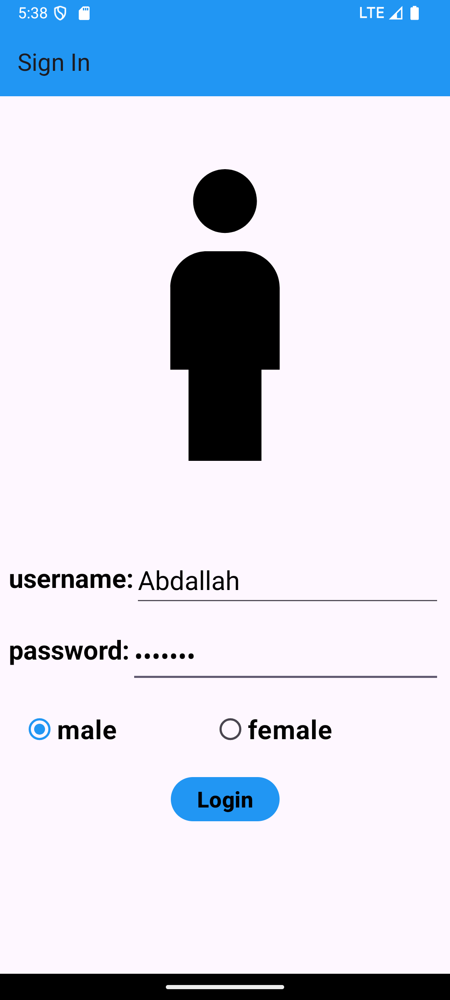

# 📱**SignIn & Places in Qena App**  

### **Project Description**  
This Android application was developed as part of the DEPI initiative. It features a SignIn screen with input validation and a dynamic list of places in Qena. The project follows best practices for RecyclerView implementation for an enhanced user experience.  

---

### **Features**  
- SignIn screen with input validation:  
  - Ensures username and password are not empty.  
  - Password must be at least 8 characters long, containing both letters and numbers.  
- Places screen displays a list of 8 locations in Qena.  
- "More" option dynamically adds 2 additional places.  
- Back button exits the app instead of returning to the SignIn screen.  

---

## Technologies Used

- **Language:** Kotlin
- **Tools:** Android Studio, XML.

---
#### Places List Screen  

## Download the app
[from here >>](https://drive.google.com/drive/folders/1k4AGk9gOIEfUT1yJBQRK8YOnPiovmFSR)

## Contact Me

If you have any questions, or if you’re interested in discussing Android development, feel free to reach out:

- [GitHub Profile](https://github.com/Abdallah-Alqiran)
- [LinkedIn](https://www.linkedin.com/in/abdallah-alqiran)
